## Part 1. Готовый докер

#### Выполняем команды
- `docker pull nginx` - Выкачать из реестра образа nginx
- `docker images` - Список образов
- `docker run -d nginx` - Запустить докер образ через
- `docker ps` - Информация о работающих контейнерах 
- 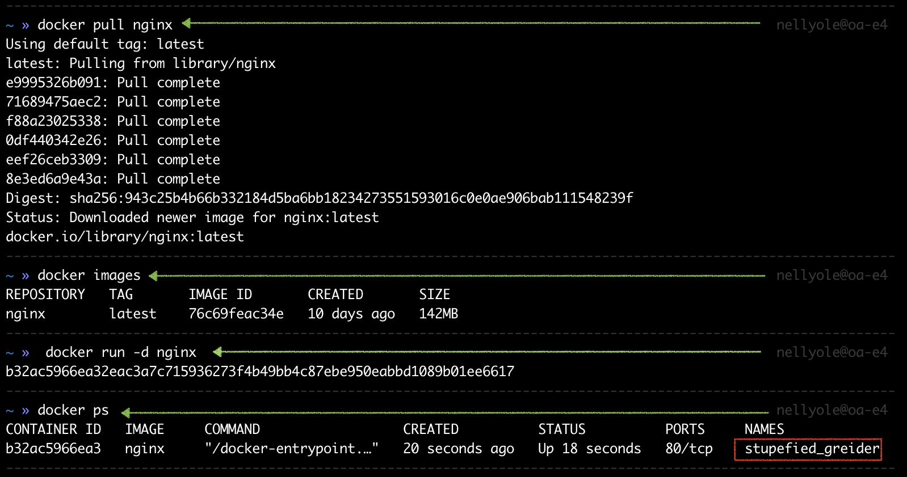 

#### Выполняем команду `docker inspect stupefied_greider`
- 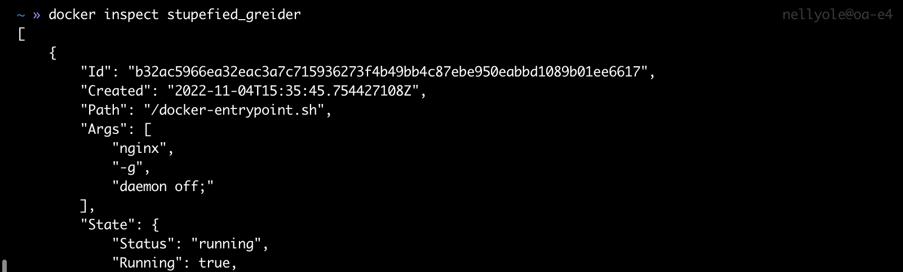
#### определяем:
* размер контейнера -` 142MB`
* список замапленных портов - `"80/tcp": null` 
###### ( от англ. глагола to map - отобразить, сопоставить (по аналогии с тем, как географическая карта отображает местность). В русскоязычном ИТ-контексте "связать" подходит по смыслу, но если разбираться педантично, можно сказать "привязать", чтобы не путать с другим смысловым значением "связать" (напр. связать абонентов телефонии). )
* IP контейнера - `172.17.0.2`

#### Выполняем команду `docker stop stupefied_greider`  
####  Выполняем команду `docker ps`  
- 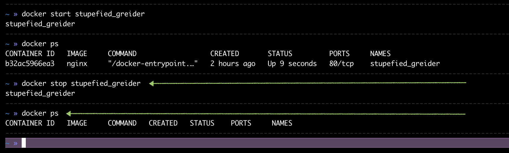   

#### Запустить докер с замапленными портами 80 и 443 на локальную машину через команду run  
- Выполняем команду `docker run -d -p 80:80 -p 443:443 nginx` 
 
- 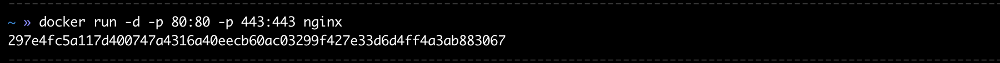   

#### Проверить, что в браузере по адресу localhost:80 доступна стартовая страница nginx

- 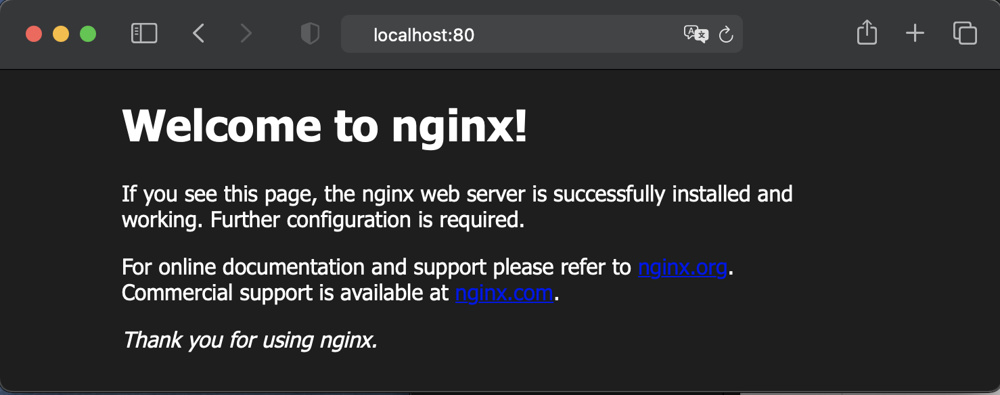   

#### Перезапустить докер контейнер через docker restart [container_id|container_name]  

- Выполняем команду `docker restart stupefied_greider
#### Проверить любым способом, что контейнер запустился  
- 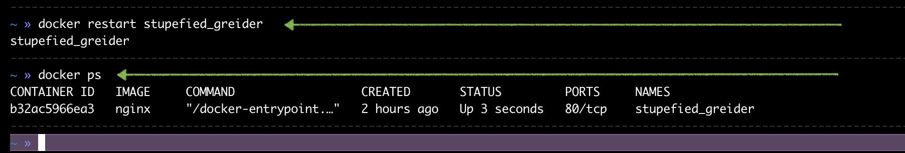   

## Part 2. Операции с контейнером

#### Прочитать конфигурационный файл nginx.conf внутри докер образа через команду exec  
- Выполняем команды: 
    - `docker exec -it stupefied_greider  bash`  
    - `cat etc/nginx/nginx.conf`  
    - `exit`  
- 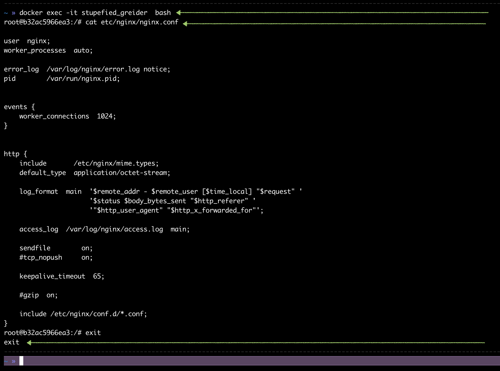   

- либо более лаконичный вариант: 
    - `docker exec stupefied_greider cat etc/nginx/nginx.conf`   
- 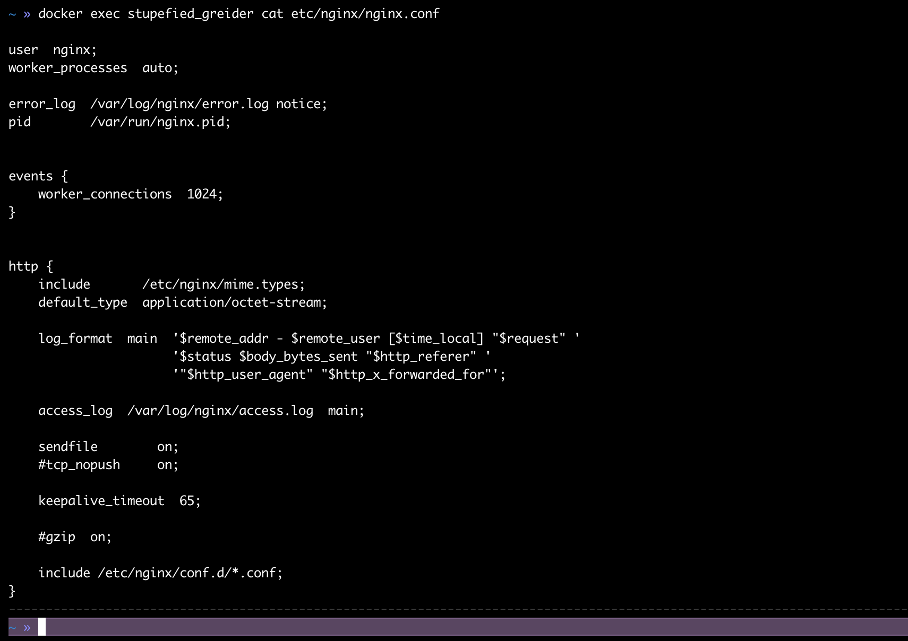   

#### Создать на локальной машине файл nginx.conf ` docker exec stupefied_greider cat etc/nginx/nginx.conf > data-samples/nginx.conf`
#### Настроить в нем по пути */status* отдачу страницы статуса сервера __nginx__  
- 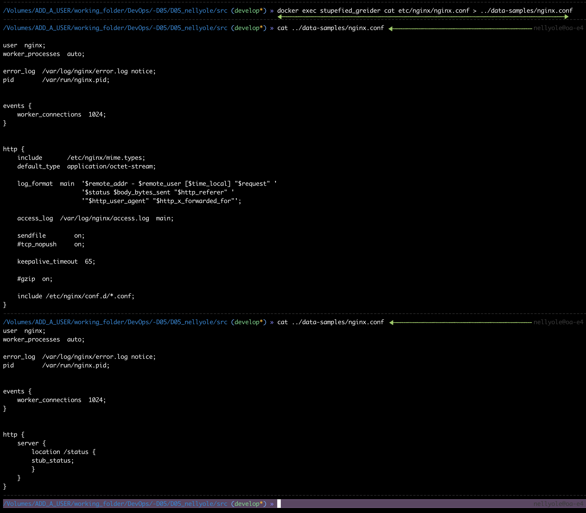   

#### Скопировать созданный файл *nginx.conf* внутрь докер образа через команду docker cp  

- Выполняем команду `docker cp data-samples/nginx.conf stupefied_greider:etc/nginx/nginx.conf` 

#### Перезапустить nginx внутри докер образа через команду exec  

- Выполняем команду `docker exec stupefied_greider nginx -s reload`
- 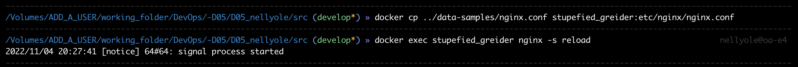   

#### Проверить, что по адресу localhost:80/status отдается страничка со статусом сервера nginx  

- Выполняем команду `curl localhost:80/status`  
- 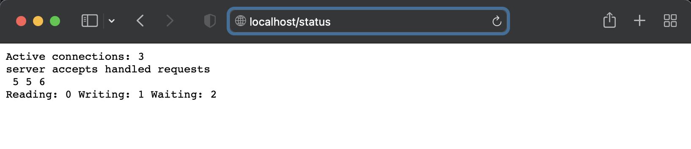   

#### Экспортировать контейнер в файл *container.tar* через команду *export*

- Выполняем команду `docker container export stupefied_greider > data-samples/container.tar`
- 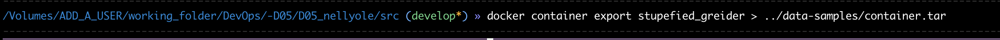   

#### Остановить контейнер  

- Выполняем команду `docker stop stupefied_greider`
- 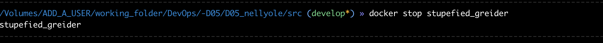   

#### Удалить образ через docker rmi [image_id|repository], не удаляя перед этим контейнеры  

- Выполняем команду `docker rmi -f nginx`  
- 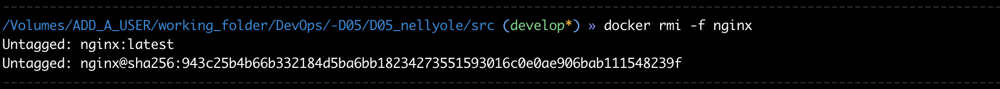   
  

#### Импортировать контейнер обратно через команду *import*  

- Выполняем команду  `docker import data-samples/container.tar cmonte_img`
- 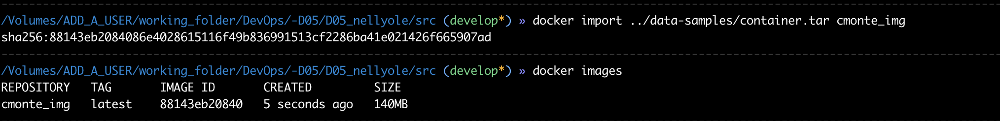   

##### Запустить импортированный контейнер  

- `docker run -itd --name imported -p 80:80 cmonte_img bash`

- `docker exec imported service nginx start` (запускаем nginx внутри контейнера)

- скрин c импортом и запуском контейнера, а также запуском сервиса nginx внутри контейнера:  
- 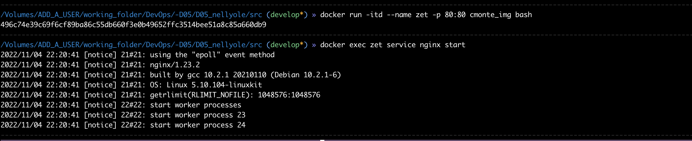   

- `curl localhost:80/status`  

- `curl localhost:80` 
- 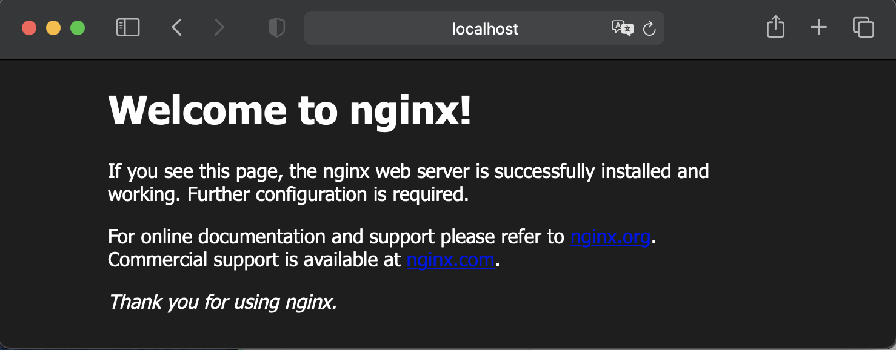   
- 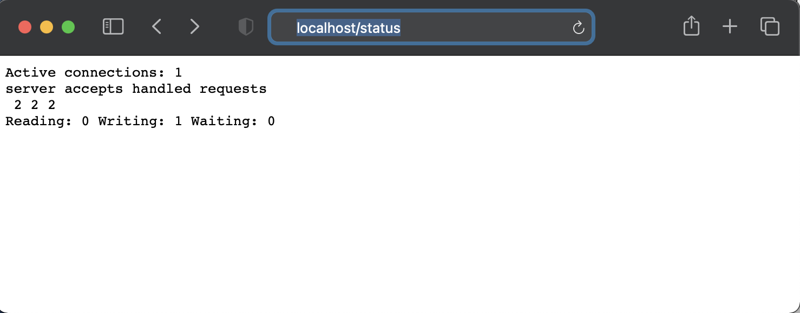   

 ## Part 3. Мини веб-сервер

Настало время немного оторваться от докера, чтобы подготовиться к последнему этапу. Настало время написать свой сервер.

**== Задание ==**

##### Написать мини сервер на **C** и **FastCgi**, который будет возвращать простейшую страничку с надписью `Hello World!`
##### Запустить написанный мини сервер через *spawn-fcgi* на порту 8080
##### Написать свой *nginx.conf*, который будет проксировать все запросы с 81 порта на *127.0.0.1:8080*
##### Проверить, что в браузере по *localhost:81* отдается написанная вами страничка
##### Положить файл *nginx.conf* по пути *./nginx/nginx.conf* (это понадобится позже)

## Part 4. Свой докер

Теперь всё готово. Можно приступать к написанию докер образа для созданного сервера.

**== Задание ==**

*При написании докер образа избегайте множественных вызовов команд RUN*

#### Написать свой докер образ, который:
##### 1) собирает исходники мини сервера на FastCgi из [Части 3](#part-3-мини-веб-сервер)
##### 2) запускает его на 8080 порту
##### 3) копирует внутрь образа написанный *./nginx/nginx.conf*
##### 4) запускает **nginx**.
_**nginx** можно установить внутрь докера самостоятельно, а можно воспользоваться готовым образом с **nginx**'ом, как базовым._

##### Собрать написанный докер образ через `docker build` при этом указав имя и тег
##### Проверить через `docker images`, что все собралось корректно
##### Запустить собранный докер образ с маппингом 81 порта на 80 на локальной машине и маппингом папки *./nginx* внутрь контейнера по адресу, где лежат конфигурационные файлы **nginx**'а (см. [Часть 2](#part-2-операции-с-контейнером))
##### Проверить, что по localhost:80 доступна страничка написанного мини сервера
##### Дописать в *./nginx/nginx.conf* проксирование странички */status*, по которой надо отдавать статус сервера **nginx**
##### Перезапустить докер образ
*Если всё сделано верно, то, после сохранения файла и перезапуска контейнера, конфигурационный файл внутри докер образа должен обновиться самостоятельно без лишних действий*
##### Проверить, что теперь по *localhost:80/status* отдается страничка со статусом **nginx**

## Part 5. **Dockle**

После написания образа никогда не будет лишним проверить его на безопасность.

**== Задание ==**

##### Просканировать образ из предыдущего задания через `dockle [image_id|repository]`
##### Исправить образ так, чтобы при проверке через **dockle** не было ошибок и предупреждений

## Part 6. Базовый **Docker Compose**

Вот вы и закончили вашу разминку. А хотя погодите...
Почему бы не поэкспериментировать с развёртыванием проекта, состоящего сразу из нескольких докер образов?

**== Задание ==**

##### Написать файл *docker-compose.yml*, с помощью которого:
##### 1) Поднять докер контейнер из [Части 5](#part-5-инструмент-dockle) _(он должен работать в локальной сети, т.е. не нужно использовать инструкцию **EXPOSE** и мапить порты на локальную машину)_
##### 2) Поднять докер контейнер с **nginx**, который будет проксировать все запросы с 8080 порта на 81 порт первого контейнера
##### Замапить 8080 порт второго контейнера на 80 порт локальной машины

##### Остановить все запущенные контейнеры
##### Собрать и запустить проект с помощью команд `docker-compose build` и `docker-compose up`
##### Проверить, что в браузере по *localhost:80* отдается написанная вами страничка, как и ранее